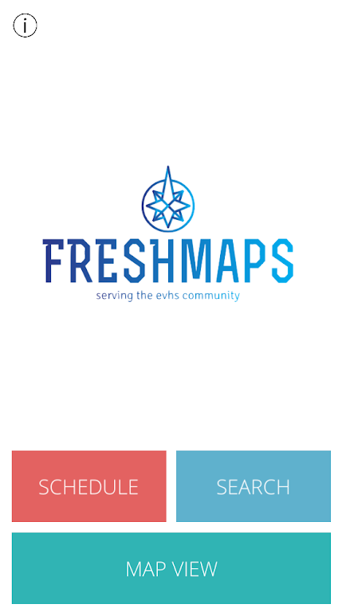
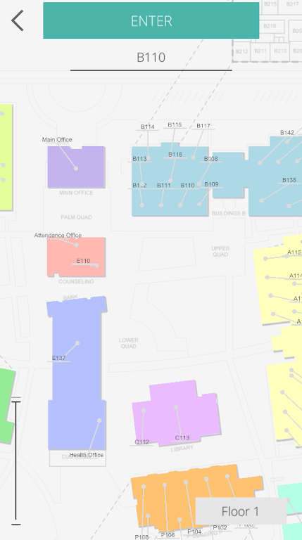
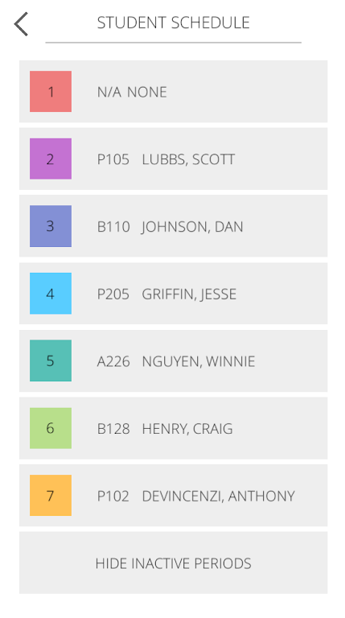
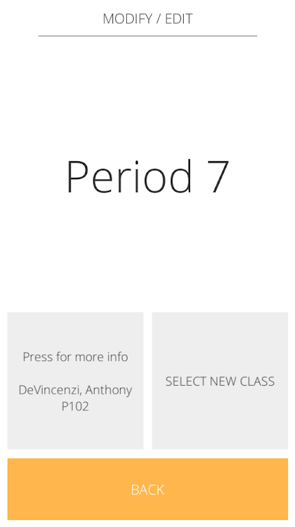
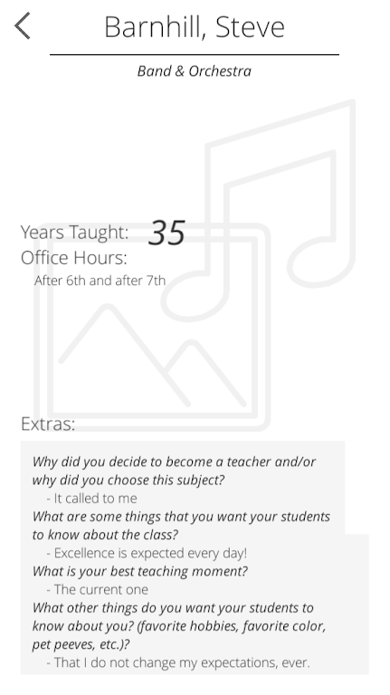
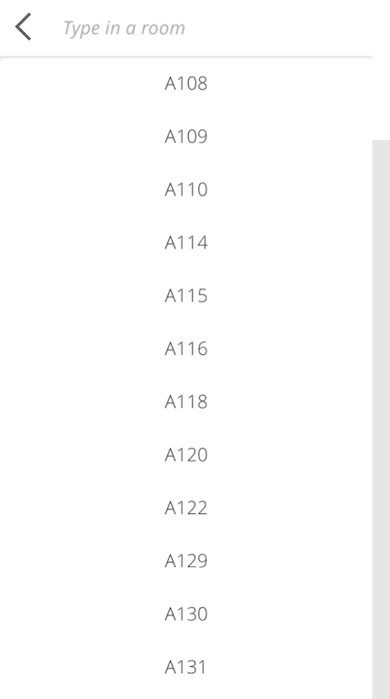

# FRESHmaps 2018 - 2019

* Original team: Abhishek Vinchure, Anirudh Kamath, Evan Nguyen, Dylan Nguyen, and Srikar Gattepalli

* Unity Team: Evan Nguyen, Marcus Chavez, Siddharth Deshpande, Chet Holagunda, Jocelin Su, Edward Phan, Sonali Naphade

This repository contains the original code presented and uploaded in the 2018 version of FRESHmaps Unity. The project was eventually abandoned beyond graduation and was later taken off the Google Play Store.

Provided inside are a few example images and an apk.

   
   
   
   
   
   

